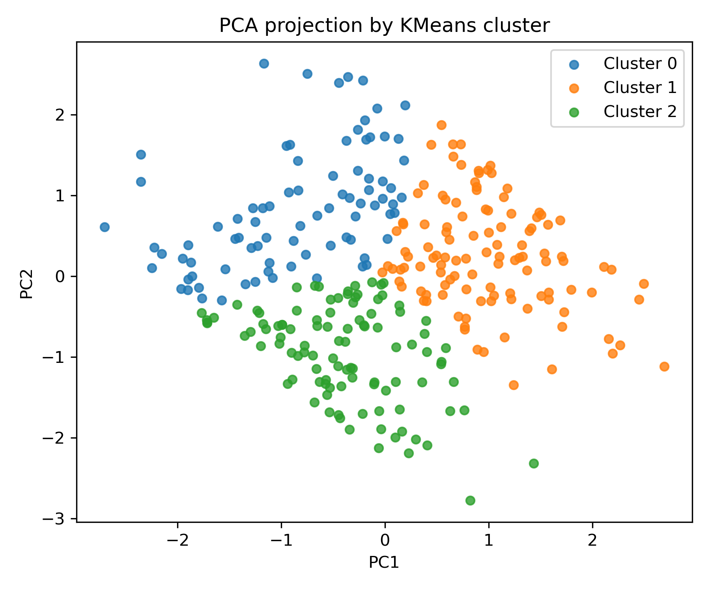
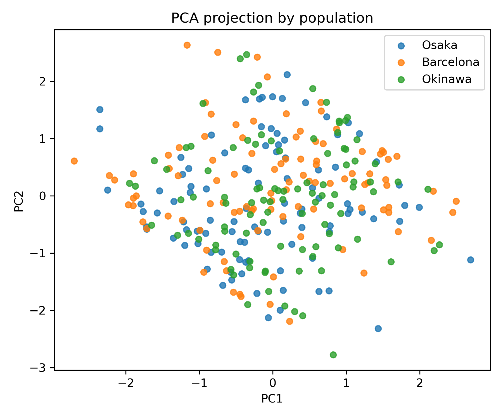

# Cryptic Speciation ML

Unsupervised machine learning pipeline exploring cryptic speciation patterns using simulated gene features (GC% and expression).  
Inspired by research on *Oikopleura dioica* genome scrambling and population divergence. (Okinawa Institute of Science and Technology OIST)

---

## Project Goal
To demonstrate how unsupervised clustering can (or cannot) recover hidden population structure when organisms appear morphologically identical but may diverge genetically.  

This project simulates gene data from three populations (Osaka, Barcelona, Okinawa) and applies exploratory data analysis (EDA) and clustering (KMeans + PCA) to investigate cryptic speciation.


## Dataset
- **Type:** Simulated dataset  
- **Size:** 300 genes (100 per population)  
- **Features:**  
  - `gc_content` → simulated GC% (30–60%)  
  - `expression` → simulated gene expression (N(10,2))  
- **File:** `data/simulated_gene_data.csv`

All populations were drawn from **identical distributions** → no true population-level signal is present.


## Methods
1. **EDA**
   - GC% distribution
   - Expression distribution
   - GC% vs Expression scatter plot by population
2. **Clustering**
   - Standardization of features
   - KMeans with k=2–6
   - Elbow and silhouette analysis
3. **Dimensionality Reduction**
   - PCA (2D projection)
   - Visualized by cluster vs population
4. **Cluster Evaluation**
   - Population ↔ Cluster contingency table
   - Approximate purity score


## Results Preview

- **Elbow & silhouette**: silhouette peaked at k=5, not at 3  
- **PCA plots**: clusters are visible but do not align with populations  
- **Purity**: ~0.39 (close to random assignment)  

 

The result generated was expected as all populations came from identical distributions.  
In real biological data or in a shifted simulation (slight differences in GC% or expression means per population), clustering would more clearly separate the three groups and mimics cryptic speciation.


## Interpretation
- **Lesson:** Without underlying signal, unsupervised ML cannot recover hidden populations.  
- **Extension:** Introducing subtle shifts would allow KMeans to align clusters with populations.  
- **Relevance:** Mirrors the challenge of detecting cryptic speciation in organisms like *Oikopleura dioica* where morphological similarity hides deep genomic divergence.


## How to Run
Clone the repo and set up environment:

```bash
git clone https://github.com/san-mhe/cryptic-speciation-ml.git
cd cryptic-speciation-ml

# Create environment
python -m venv .env
# Activate: source .env/bin/activate (Linux/macOS) OR .env\Scripts\activate (Windows)

# Install dependencies
pip install -r requirements.txt
